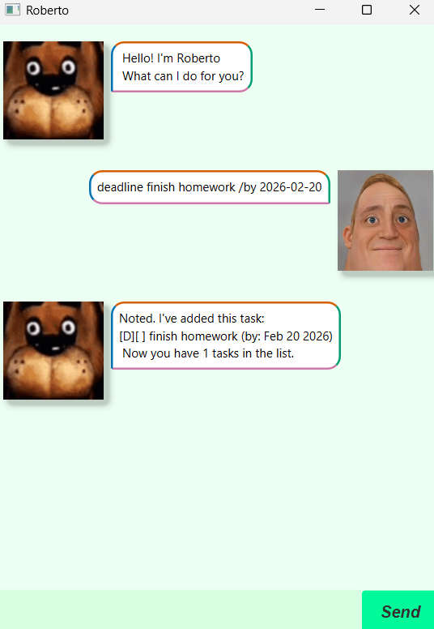

# Roberto User Guide



Manage your tasks with Roberto!

## Adding Tasks

Allows Roberto to insert tasks into a list

Commands:
- `todo <name>`
- `deadline <name> /by <date: yyyy/mm//dd>`
- `event <name> /from <date: yyyy/mm//dd> /to <date: yyyy/mm//dd>`


Example: `deadline finish homework /by 2026-02-20`

```
Noted. I've added this task:
[D][ ] finish homework (by: Feb 20 2026)
Now you have 1 tasks in the list
```

## Display list
Shows entire tasks within the list by order of insertion

Command: `list`

## Deleting tasks
Delete tasks by index from the list

Command: `delete <index>`

## Updating tasks
Mark/unmark tasks by index to update the status of your tasks

Command: `mark <index>` `unmark <index>`

## Undo
Restore stored tasks to its previous state based on previous command.
Commands do not save upon exit.

Command: `undo`

## Exit
Exit the program

Command: `bye`